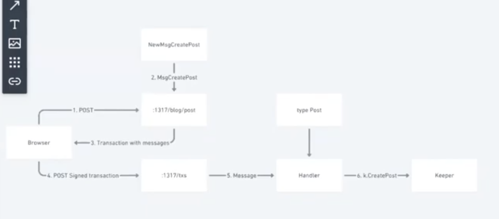

# Starport-Poll

Tools used:
1. `Starport` -> For generating, serving and scaffolding the application.

`starport app github.com/GITHUB-USERNAME/APP-NAME` to scaffold the application.

In the app directory;
1. `app/app.go` is the main file of our application, ties together all modules and permissions.
2. `cmd` directory with two directories for CLI (Interacting with application) commands and d (Node) commands.
3. `frontend` directory for web based view client. We can use any framework we want. The default framework used if `Vue.js`
4. `x` directory containing customer modules.

`starport serve` to run the application.

Generate data type in the blockchain
`startport type NAME PROPERTIES`

`starport type poll title options`

This generates several files for us in `x/types/poll`

`x/poll/types/TypePoll.go` -> This file contains definition of the `Poll` type. We can see that a poll has two fields (creator and ID), which will be created automatically, and two fields (title and options) **defined by us**. Since we want Options to be a list of strings, replace `string` with `[]string`.

`x/poll/types/MsgCreatePoll.go` -> This file defines a message that creates a poll.

To write anything to a blockchain or perform any other state transition a client (web app in our case) makes an HTTP POST request with a title and options to `http://localhost:1317/voter/poll` endpoint handler for which is defined in `x/poll/client/rest/txPoll.go`. The handler creates an unsigned transaction which contains an array of messages. The client then signs the transaction and sends it to `http://localhost:1317/txs`. The application then processes the transaction by sending each message to a corresponding handler, in our case `x/poll/handlerMessageCreatePoll.go`. A handler then calls a `CreatePoll` function defined in `x/voter/keeper/poll.go` which writes the poll data into the store.

Going back to `MsgCreatePoll.go`, we need to make options to be stored as a list instead of a string. Replace `Options string` with `Options []string` in `MsgCreatePoll` struct and `options string` with `options []string` in the arguments of `NewMsgCreatePoll` function.

`x/poll/client/rest/txPoll.go` -> Replace `Options string` with `Options []string` in `createPollRequest` struct.

`x/poll/client/cli/txPoll.go` -> A user can also interact with our application through a command line interface.

`pollcli tx poll create-poll "Text editors" "Emacs" "Vim" --from user1`

This command will generate a transaction with "create poll" message, sign it using a private key of `user1` (one of two users created by default) and broadcast it to the blockchain.

The only modification we need to make is to change a line that reads arguments from the console: `argsOptions := args[1:len(args)]`. This will assume that all arguments after the first one represent a list of options.